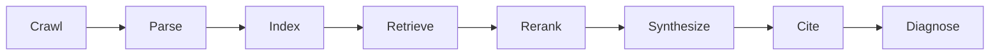

# CiteStage

[](https://github.com/DivitMittal/citestage/actions/workflows/ci.yml) [](https://github.com/DivitMittal/citestage/actions/workflows/flake-check.yml)  

A stage-level debugger for citation failures in generative answer engines.

CiteStage models an answer-engine pipeline as crawl → parse → index → retrieve → rerank → synthesize → cite. It runs locally over a controlled corpus of target docs, competitor docs, and distractors, then diagnoses which stage caused the target project to not be cited. It is a deterministic local simulator, not a clone of Google AI Overviews, ChatGPT browsing, Perplexity, or any production answer engine.



## Installation

### Nix dev shell

Enter the repository development shell with:

```sh
nix develop
```

The dev shell is exposed as `devShells.<system>.default`, so `nix develop .#default` is equivalent from the repository root.

### Running via flake

This flake currently exposes a workflow-rendering package, not a `citestage` app. The runnable package that exists is:

```sh
nix run .#render-workflows -- --help
```

Use the dev shell plus `cargo run`, or install the CLI with Cargo, to run CiteStage itself.

### Cargo install

Install the local CLI binary from the workspace:

```sh
cargo install --path crates/citestage-cli
```

After installation, run `citestage --help` to inspect the available commands.

## Quickstart

```sh
cargo run -p citestage-cli -- init \
  --target examples/corpora/oss-nix/target/README.md

cargo run -p citestage-cli -- run \
  --corpus examples/corpora/oss-nix/corpus.yaml \
  --query "best NixOS home manager flake template for reproducible machines" \
  --output examples/traces/sample-trace.json

cargo run -p citestage-cli -- explain \
  --corpus examples/corpora/oss-nix/corpus.yaml \
  --query "best NixOS home manager flake template for reproducible machines" \
  --output examples/reports/sample-diagnosis.md
```

## Commands

| Command | What it does |
| --- | --- |
| `init` | Creates a starter `corpus.yaml` manifest for a target README or source document. |
| `corpus build` | Ingests local target, competitor, and distractor documents into corpus JSON. |
| `run` | Runs the deterministic local pipeline and writes a JSON stage trace. |
| `explain` | Runs the pipeline and writes an evidence-backed Markdown diagnosis report. |
| `patch-plan` | Prints the suggested repair plan from a previously generated stage trace. |
| `compare` | Compares two diagnosis traces at the primary-failure summary level. |

## Example diagnosis

The sample diagnosis is generated from the fixture corpus with:

```sh
cargo run -p citestage-cli -- explain \
  --corpus examples/corpora/oss-nix/corpus.yaml \
  --query "best NixOS home manager flake template for reproducible machines" \
  --output examples/reports/sample-diagnosis.md
```

Excerpt from [the full sample report](examples/reports/sample-diagnosis.md):

| Stage | Status | Target rank | Evidence |
| --- | --- | --- | --- |
| crawl | Pass | — | loaded 5 documents |
| parse | Partial | 1 | parsed 4 sections; clarity score 0.40; no one-sentence definition detected near the top |
| index | Pass | 1 | target produced 4 indexable chunks |
| retrieve | Pass | 2 | target chunk retrieved at rank 2 |
| rerank | Pass | 2 | target moved from retrieval rank 2 to rerank rank 2 |
| synthesize | Pass | — | deterministic extractive answer produced |
| cite | Pass | 2 | target cited at citation position 2 |

Primary failure: **ParseFailure** at stage `parse`.

## Failure taxonomy

| Stage | Signal | Repair |
| --- | --- | --- |
| Crawl | Target absent from corpus | Add README, links, llms.txt |
| Parse | Missing definition or weak structure | Add one-sentence definition and headings |
| Index | No target chunks | Split sections and add summaries |
| Retrieve | Target absent from top-k | Add query-aligned use cases |
| Rerank | Target demoted | Improve clarity and quickstart placement |
| Synthesis | No answer-shaped evidence | Add concise source-supported paragraphs |
| Cite | Competitors cited instead | Add source-specific examples and canonical URLs |
| Factuality | Citation does not support claim | Remove or source unsupported claims |

## Workspace

- `citestage-core`: shared domain types and serde models.
- `citestage-corpus`: corpus manifest and README ingestion.
- `citestage-parse`: Markdown section parsing and structural features.
- `citestage-index`: deterministic hand-rolled BM25 chunk index.
- `citestage-retrieve`: top-k retrieval and target-rank tracing.
- `citestage-rerank`: feature-based reranking.
- `citestage-generate`: deterministic extractive mock generator.
- `citestage-diagnose`: first failing stage diagnosis and repair plans.
- `citestage-report`: Markdown report rendering.
- `citestage-cli`: `citestage` command-line interface.

## Documentation

- [Architecture](docs/architecture.md)
- [Citation failure taxonomy](docs/citation-failure-taxonomy.md)
- [Local simulator validity](docs/local-simulator.md)
- [Evaluation](docs/evaluation.md)
- [Ethics](docs/ethics.md)

## Pairs with AnswerCI

CiteStage diagnoses **why** a target is not cited in a controlled local pipeline; [AnswerCI](https://github.com/DivitMittal/answerci) tracks **whether** visibility or citations regress across runs in CI. They answer different questions: CiteStage is for offline, fixture-based stage diagnosis, while AnswerCI is for ongoing citation visibility checks.

## Roadmap

### MVP

- Local corpus manifests.
- Markdown parsing and structural clarity signals.
- BM25 retrieval, simple reranking, deterministic citation assignment.
- JSON traces and Markdown reports.

### Strong v1

- Hybrid vector retrieval.
- Controlled before/after interventions.
- AnswerCI integration.
- Reproducible experiment bundles.
- Larger benchmark corpora with human-labeled expected citations.
