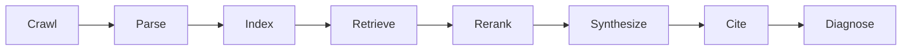

# CiteStage

A stage-level debugger for citation failures in generative answer engines.

CiteStage models an answer-engine pipeline as crawl → parse → index → retrieve → rerank → synthesize → cite. It runs locally over a controlled corpus of target docs, competitor docs, and distractors, then diagnoses which stage caused the target project to not be cited.



## Quickstart

```sh
cargo run -p citestage-cli -- init --target examples/corpora/oss-nix/target/README.md
cargo run -p citestage-cli -- run   --corpus examples/corpora/oss-nix/corpus.yaml   --query "best NixOS home manager flake template for reproducible machines"   --output examples/traces/sample-trace.json
cargo run -p citestage-cli -- explain   --corpus examples/corpora/oss-nix/corpus.yaml   --query "best NixOS home manager flake template for reproducible machines"   --output examples/reports/sample-diagnosis.md
```

## Failure taxonomy

| Stage | Signal | Repair |
| --- | --- | --- |
| Crawl | Target absent from corpus | Add README, links, llms.txt |
| Parse | Missing definition or weak structure | Add one-sentence definition and headings |
| Index | No target chunks | Split sections and add summaries |
| Retrieve | Target absent from top-k | Add query-aligned use cases |
| Rerank | Target demoted | Improve clarity and quickstart placement |
| Synthesis | No answer-shaped evidence | Add concise source-supported paragraphs |
| Cite | Competitors cited instead | Add source-specific examples and canonical URLs |
| Factuality | Citation does not support claim | Remove or source unsupported claims |

## Workspace

- `citestage-core`: shared domain types and serde models.
- `citestage-corpus`: corpus manifest and README ingestion.
- `citestage-parse`: Markdown section parsing and structural features.
- `citestage-index`: deterministic hand-rolled BM25 chunk index.
- `citestage-retrieve`: top-k retrieval and target-rank tracing.
- `citestage-rerank`: feature-based reranking.
- `citestage-generate`: deterministic extractive mock generator.
- `citestage-diagnose`: first failing stage diagnosis and repair plans.
- `citestage-report`: Markdown report rendering.
- `citestage-cli`: `citestage` command-line interface.

## Roadmap

### MVP

- Local corpus manifests.
- Markdown parsing and structural clarity signals.
- BM25 retrieval, simple reranking, deterministic citation assignment.
- JSON traces and Markdown reports.

### Strong v1

- Hybrid vector retrieval.
- Controlled before/after interventions.
- AnswerCI integration.
- Reproducible experiment bundles.
- Larger benchmark corpora with human-labeled expected citations.
